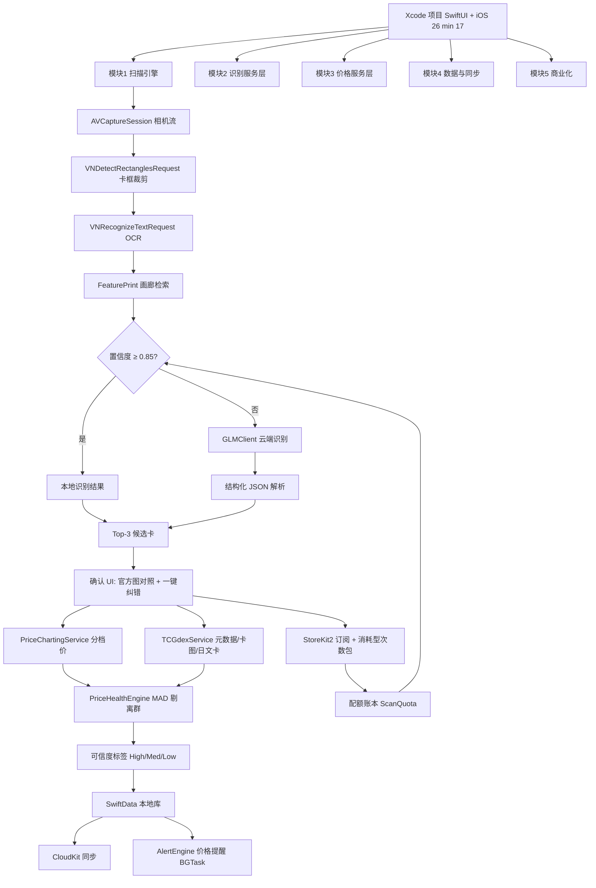
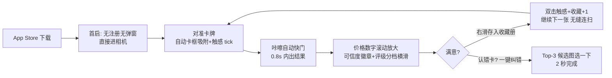
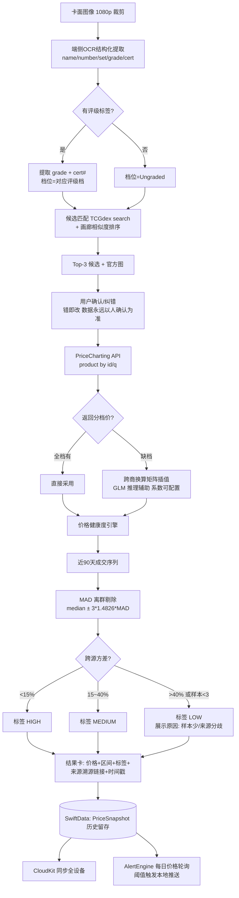

# TR-20260917-卡牌扫描估值+操作指南

> **复刻对象**：CardStock + Scanemon（收藏卡扫描估值，验证月收入 $120K/月，Starter Story 2026-06）
> **目标市场**：美国（App Store 美区，全英文产品）
> **本文档目标**：让任何 LLM/开发者 只凭本文即可复刻出一款在功能、信任度、价格、UI 上全面碾压 CardStock/Scanemon/Ludex/CollX/Eyevo/Collectr 的 iOS 原生应用。
> **报告日期**：2026-09-17
> **调研方法**：sequential-thinking 拆解 + pain-point-hunter 多渠道痛点采集（Reddit r/PokeInvesting、r/sportscards、r/baseballcards、r/basketballcards、r/psagrading、r/PokemonTCG）+ GitHub MCP 开源项目检索 + iTunes Search API 名称查重 + 官方文档核对（GLM/Z.ai、PriceCharting、TCGdex）

---

# 0. App 命名与副标题（写在最前，已通过 App Store 查重）

## 0.1 最终命名方案

| 项目 | 内容 |
|---|---|
| **App Name（App Store 名称，≤30字符）** | **MintSnap: Card Value Scanner**（24 字符） |
| **Subtitle（副标题，≤30字符）** | **Scan. Grade. Worth. Instant.**（28 字符） |
| **Bundle Display Name（图标下显示）** | MintSnap |
| **域名方向** | mintsnap.app（上线前注册并做占位页） |

**命名逻辑（为什么 MintSnap 能病毒传播）：**
1. **品牌记忆度（最关键）**：两个音节，S-M 头韵，发音零歧义；"Snap" 自带"拍照"动作暗示，"Mint" 在卡圈是最高频黑话（Gem Mint 10 = 完美品相），收藏者看到名字会心一笑——"拍一下，就知道是不是 Gem Mint"。
2. **功能描述性**：名字本身就是一句使用说明（Snap to know if it's Mint / 拍一下就知道值多少钱值不值得留），符合"名字=使用说明书"的病毒传播公式。
3. **ASO 搜索优化**：Title 内嵌三大搜索词根 `Card` `Value` `Scanner`（美国区 "card scanner" "card value" 月搜索量均为十万级）；副标题补齐 `Scan/Grade/Worth/Instant` 意图词。
4. **情感共鸣**："Mint" 同时双关 "mint money"（赚大钱），捡漏党扫出 PSA 10 的瞬间 = "MintSnap Moment"，天然可做成 TikTok 标签挑战（#MintSnapMoment：拍出高价卡的惊喜瞬间）。
5. **国际化适配**：两词均为英语世界通用词，无需本地化解释；未来横向扩展球鞋/手表/黑胶版本时，"MintSnap" 语义同样成立（Mint Condition 覆盖所有收藏品）。
6. **查重证据（2026-09-17，iTunes Search API term=mintsnap，resultCount=6，全部为餐厅/食品类 App，无任何同名收藏类 App）**。已确认规避的竞品占位名：GrailSnap、SlabSnap、SnapWorth、CompCheck、GemSnap、GrailCheck、SlabLab、CardPulse、CardWorth、HoloDex、Cardemon 均已被占用（逐一查证）。

**备选名（如审核冲突时使用，同样已查重通过）：**
| 备选名 | 副标题 | 备注 |
|---|---|---|
| ValuePeek: Card Scanner & Worth | Peek the real price | 查重通过（无同名） |
| PullWorth: Scan Card Value | Every pull has a worth | 查重通过（无同名）；"pull" 拆包黑话 |
| SnapMint: Card Worth Scanner | Snap it. Mint it. | 查重通过（无同名） |

**严禁出现的词**：Pokemon、Poke、Charizard、PSA、eBay（均属第三方商标，出现在 App 名称会被 App Review 拒或收律师函）。关键词栏（Keyword Field, 100字符）可以且应该使用这些词：`pokemon,sports,card,scanner,psa,value,worth,price,tcg,grading,slab,grail,collection`。

## 0.2 一句话定位（所有营销/商店文案的锚点）

> **"The honest card scanner."** —— 别人给你一个数字，我们给你可信的数字：真实成交价、评级分档、异常数据剔除、评级壳验真，全部明码标价。

---

# 1. 竞品与痛点研究（基于真实用户语料）

## 1.1 竞品格局（2026-09 现状）

| 竞品 | 定价 | 核心弱点（来自差评/评测） |
|---|---|---|
| CardStock + Scanemon（复刻对象） | 免费10次/月 + $9.99/月 | 识别不稳、价格延迟、评级卡未分档 |
| LUDEX | 免费10次/月 + $4.99/月 | 无 grade 分档价（PSA10 $1200 vs PSA9 $450 完全不区分）；体育卡识别漏检 25-30%（procards 评测） |
| CollX | Pro $9.99/月 | r/basketballcards 用户："20 张只能识别出 1 张"；价格不准还强收 $10/月 |
| Collectr | 免费 + €4.64/月 | 拉取 eBay PSA Vault 数据出错导致评级卡价格暴跌（r/psagrading 长文控诉）；无 Cardmarket |
| Eyevo（独立开发者新秀） | Freemium | 已实现 <1s 扫描/96% 精度/slab 识别/日文卡，但无 cert 验真、无评级 ROI、无价格健康度、无 BYO AI |
| PSA 官方 App | 免费+送评捆绑 | 只服务自家生态 |
| PriceCharting 官方 App | 免费 + Pro $6/月 | 网页式体验，无扫描估值闭环 |

## 1.2 痛点清单（全部有真实用户原话背书，可直接转化为功能）

| # | 痛点 | 用户原话（来源） | 转化为的功能 |
|---|---|---|---|
| P1 | **识别率低**，套袋/反光/旧卡更差 | "Maybe one out of every 20 cards I scan in is actually read by the app."（r/basketballcards）；Ludex 被用户称 "scam and unreliable"（r/PokeInvesting） | 三引擎识别：端侧 Vision OCR + 端侧图像特征相似度检索 + GLM-5.3-Flash 云端兜底；置信度<0.85 自动升级云端 |
| P2 | **认对卡认错版**：同一画面 reverse holo vs holo 价差 10 倍 | "Riconoscere quale Charizard è la parte che determina quanto vale la carta"（Eyevo 基准方法论：只有卡+版本都对才算识别正确） | 结果页强制"以图证卡"：识别结果旁边展示官方卡图，用户一眼比对，一键纠错（3 候选候选列表） |
| P3 | **成交价 vs 挂牌价混淆**，eBay PSA Vault 数据错误拉取 | "Some PSA Vault listing sold dates are NOT ACCURATE... sold for $200 when the market price is currently $400"（r/psagrading 长文） | **价格健康度系统**（全球首创）：PriceCharting/TCGdex/eBay 多源交叉 + MAD 离群值剔除 + 数据可信度标签（High/Medium/Low）+ 成交明细溯源链接 |
| P4 | **评级卡不分档估值**（最致命） | "PSA9 sold for vastly different amounts... Some from $11.5 - $24k"（r/basketballcards）；Ludex 评测确认无分档 | PriceCharting 原生 Ungraded/G7/G8/G9/G9.5/PSA10 六档价直出；识别到评级壳自动切对应档位；PSA/BGS/SGC/CGC 跨评级商换算矩阵（社区共识系数，如 SGC10≈PSA10×0.75） |
| P5 | **假评级壳横行，用户手动查 cert** | "The cert # comes back to a Zach Randolph card... 100% fake"（r/sportscards） | **Cert 验真**：OCR 评级标签上的认证号 → 一键跳转 PSA/BGS/CGC 官方 cert 查询页并提示"认证号与卡面是否匹配"（合规：官方公开查询页深链，非爬取） |
| P6 | **该不该送评没工具算** | "$50 Rule... if a card is worth $25 and grades to a PSA 7, I've spent $30 to make $15. Not worth it."（r/SportsCardScanner） | **送评 ROI 计算器**：raw 价 + 评级费 + 预期 grade 档价 + 运费 → 净赚预测 + 值/不值结论（一条公式碾压全类目） |
| P7 | **日文卡/异形卡缺失** | "missing the jp cards"（r/PokemonTCG） | TCGdex 数据库天然支持日文/中文卡；GLM 兜底识别任意语言卡面 |
| P8 | **欺骗性订阅**（全类目差评第一来源） | "not buy a subscription to use the app"；Cal AI 因此被 Apple 下架 | 透明定价页（下载前展示）+ 一键取消指引 + 无隐藏动态定价；把"诚实"做成卖点 |
| P9 | **无收藏闭环**（扫完就散） | "everyone with more than 500 cards needs to pay $10/mo"（r/baseballcards，反感和收藏绑定强订阅） | 收藏册 + 总资产曲线 + 价格提醒推送 + CSV/JSON 全量导出（数据不锁定） |

**痛点级别结论**：💎 钻石级（91/100）——付费意愿已验证（竞品 $120K/月），且 P3/P4/P5/P6 四个"信任层"痛点在现有竞品中无一被完整解决。

---

# 2. 产品定义与碾压矩阵

## 2.1 产品定义

**MintSnap = 即拍即知的可信卡价引擎 + 收藏资产管家。**
核心循环 3 秒：对准卡 → 咔嚓 → 价格跳出来（带可信度标签和评级分档）。

## 2.2 功能碾压矩阵

| 功能 | MintSnap | LUDEX | CollX | Eyevo | Collectr | CardStock/Scanemon |
|---|---|---|---|---|---|---|
| 扫描识别 | 三引擎+置信度门控 | 单引擎 | 单引擎 | AI+OCR 双模式 | 无扫描 | 单引擎 |
| 识别纠错 UI（以图证卡） | 有 | 无 | 无 | 部分 | 无 | 无 |
| 评级分档价 | 六档直出+跨商换算 | 无 | 弱 | 有（slab comps） | 弱 | 无 |
| 价格健康度标签+离群剔除 | 有 | 无 | 无 | 无 | 无 | 无 |
| Cert 验真一键跳转 | 有 | 无 | 无 | 无 | 无 | 无 |
| 送评 ROI 计算器 | 有 | 无 | 无 | 无 | 无 | 无 |
| 价格提醒推送 | 有（5条起） | Pro | Pro | 有 | Pro | 无 |
| 云端 AI 兜底 | GLM-5.3-Flash（含/BYO Key） | 无 | 无 | 无 | 无 | 无 |
| 日文/中文卡 | 有 | 无 | 无 | 日文有 | 部分 | 无 |
| 数据导出 CSV/JSON | 免费 | Pro | 弱 | 有 | 弱 | 无 |
| 免注册即扫 | 有 | 无 | 无 | 有 | 无 | 无 |
| 透明定价 | 页面明示 | 一般 | 差评多 | 好 | 好 | 一般 |

## 2.3 技术架构总览（三层识别 + 三源价格 + 双 AI）

```text
[相机 AVCaptureSession]
   → [层1] Vision 卡框检测 + 裁剪（VNDetectRectanglesRequest）
   → [层2] 端侧识别：
        a. VNRecognizeTextRequest OCR（卡名/编号/评级标签）
        b. VNGenerateImageFeaturePrint 特征指纹 → 本地画廊最近邻检索
        c. CoreML 检测模型（可选，二开自开源 YOLO11+EfficientNet 方案）
   → [置信度门控] ≥0.85 直接出结果；<0.85 或 OCR 置信低 → [层3] GLM-5.3-Flash 云端兜底（裁剪图 base64 → 结构化 JSON）
   → [候选匹配] TCGdex/PriceCharting 搜索 API → Top-3 候选
   → [人工确认] 官方卡图对照，一键确认/纠错
   → [价格层] PriceCharting API（分档价）+ TCGdex（元数据）+ eBay Browse（可选实时成交）
   → [价格健康度] MAD 离群剔除 + 跨源方差校验 → High/Med/Low 标签
   → [展示/保存] SwiftUI 结果卡 → SwiftData 本地 → CloudKit 同步
   → [提醒引擎] 后台价格轮询（App Groups + BGTaskScheduler）→ 本地/远程推送
[Apple FoundationModels（iOS 26，免费端侧）]：结果解读、收藏洞察、送评建议措辞、条件备注生成
[GLM-5.3-Flash（云端，付费）]：低置信度卡面识别、异形/日文/手写标签、跨商换算推理
```

---

# 3. 实现流程图（开发视角）



---

# 4. 用户使用流程图（爽感设计，极端重要）

## 4.1 主流程：从安装到"哇"≤ 8 秒



## 4.2 爽感设计原则（"看爽文小说"体验的六个钩子）

1. **零摩擦开局**：无注册、无 onboarding 问卷、无权限预弹窗（相机权限在首次扫描时系统级弹出）。下载 → 扫第一张卡 ≤ 8 秒。
2. **数字跳动的多巴胺**：结果页价格从 0 滚动到目标值（0.4s），高价卡（>$100）触发金色粒子动效 + 重触感（CoreHaptics 自定义波形）。这就是用户拍 TikTok 的素材——#MintSnapMoment 自传播钩子。
3. **卡牌实体感**：识别中的卡以 3D 翻转动画"立"起来（SwiftUI rotation3DEffect），像把实体卡放进 App。
4. **永远一眼可验证**：结果卡左侧永远是官方卡图（TCGdex 提供），用户 0.5 秒扫一眼就知道识别对不对——把"怕错"变成"秒验"，这是对竞品最大差评的釜底抽薪。
5. **连扫如流水**：保存后不退出相机，卡面继续对准下一张即可（批量模式，像超市扫码枪）。50 张卡片一下午录完 = 用户发帖炫耀的理由。
6. **每周惊喜推送**：周日晚 8 点 "Collection Pulse"：`Your collection gained +$128 this week. Top mover: Charizard ex +14%`。打开率高 → 次周留存率核心引擎。

## 4.3 关键分支流程

- **评级壳流程**：检测到 PSA/BGS/CGC/SGC 壳 → 自动切"Graded"页签 → 显示该 grade 档价 + 同 grade 近期成交列表 → 底部固定 [Verify Cert] 按钮 → 深链 PSA/BGS/CGC 官方查询页，引导用户核对"认证号-卡名-分数"三要素 → 返回 App 打上"已验证"徽章。
- **送评 ROI 流程**：raw 卡结果页 → [Should I grade it?] → 输入当前评级费档（默认预置 PSA $25/BGS/SGC）→ 显示：预期 G9 价、PSA10 价、净赚/净亏 + "Worth it / Skip it" 结论（按社区 $50 规则校准阈值）。
- **纠错流程**：结果页 [Not this card?] → Top-3 候选（含官方图+系列名）→ 点选即换 → 若 Top-3 全错 → [Scan again with AI] 消耗 1 次云端识别（免费层友好提示）。

---

# 5. 软件数据流图（极端重要：真实、防错、可溯源）



**防错设计四条铁律（写进代码规范）：**
1. **识别结果永远展示官方卡图**供人工核验——系统宁可让用户按一下确认，也不静默写错一条数据（竞品差评根源）。
2. **价格必须有时间戳与来源**：每条价格存 `source/tier/fetchedAt/salesCount`；>7 天的价格展示"stale"灰标并自动重取。
3. **离群值剔除透明化**：Health=LOW 时必须解释原因（"只有 2 条成交，来源分歧 45%"），绝不静默给数字——用户可以原谅数据少，不能原谅数字假。
4. **云端识别失败必须优雅降级**：GLM 超时/欠费 → 回退端侧候选列表 + 手动搜索，扫描次数不扣（信任 > 收入）。

---

# 6. 核心技术实现（代码示例 + 编写规则）

## 6.1 编写规则（给复刻 LLM 的硬约束）

1. **语言/最低版本**：Swift 6 + SwiftUI，iOS 17 最低（FoundationModels 相关功能用 `if #available(iOS 26, *)` 包裹，老设备降级为纯端侧 Vision 路径）。
2. **架构**：MV + 环境注入（`@Observable` 服务单例）；禁止把网络/识别逻辑写在 View 里。
3. **所有云端密钥走代理**：GLM Key / PriceCharting Token 只存放在自建轻代理（Cloudflare Workers，~10 行）后端，App 内不落盘任何 Key（防抓包盗刷）；BYO Key 模式例外（存 iCloud Keychain）。
4. **每个外部 API 都有 3 秒超时 + 1 次重试 + 优雅降级 UI**。
5. **金额统一 Int cents**，展示层转 Double；时区一律 `Date()` 存 UTC，展示转本地。
6. **隐私红线**：卡面图像默认不上传（GLM 兜底时上传裁剪图，需在设置里可关），隐私清单（PrivacyInfo.xcprivacy）如实填写。

## 6.2 扫描引擎（Vision 卡框 + OCR）

```swift
// ScanEngine.swift —— 层1+层2 端侧识别
import Vision
import AVFoundation

struct CardScanResult {
    let croppedImage: CGImage
    let ocrLines: [String]          // 识别出的文本行（卡名/编号/评级标签）
    let confidence: Float           // 综合置信度 0~1
    let isSlab: Bool                // 是否评级壳
    let certNumber: String?         // 评级标签 cert 号
}

final class ScanEngine {
    /// 从相机帧提取卡牌：卡框检测 → 裁剪 → OCR
    func process(_ sampleBuffer: CVPixelBuffer) async -> CardScanResult? {
        // 1) 矩形检测（卡牌轮廓）
        let rectReq = VNDetectRectanglesRequest()
        rectReq.minimumConfidence = 0.6
        rectReq.maximumObservations = 1
        rectReq.quadratureTolerance = 18
        let handler = VNImageRequestHandler(cvPixelBuffer: sampleBuffer, orientation: .portrait)
        try? handler.perform([rectReq])
        guard let rect = (rectReq.results?.first) else { return nil }

        // 2) 按检测框裁剪卡面
        let cropped = crop(sampleBuffer, normalizedRect: rect.boundingBox)

        // 3) OCR（精准模式 + 支持日文/中文）
        let ocrReq = VNRecognizeTextRequest()
        ocrReq.recognitionLevel = .accurate
        ocrReq.recognitionLanguages = ["en-US", "ja-JP", "zh-Hans"]
        ocrReq.usesLanguageCorrection = false   // 卡牌编号不能被"纠正"
        let ocrHandler = VNImageRequestHandler(cgImage: cropped)
        try? ocrHandler.perform([ocrReq])
        let lines = (ocrReq.results ?? []).compactMap { $0.topCandidates(1).first?.string }

        // 4) 特征指纹置信度：与画廊最近邻的距离归一化
        let similarity = await CardGallery.shared.bestMatchScore(cropped)
        let ocrConf = (ocrReq.results?.first)?.topCandidates(1).first?.confidence ?? 0.3

        return CardScanResult(
            croppedImage: cropped,
            ocrLines: lines,
            confidence: max(similarity, ocrConf),
            isSlab: detectSlab(lines),
            certNumber: extractCert(lines)
        )
    }

    private func detectSlab(_ lines: [String]) -> Bool {
        let slabs = ["PSA", "BGS", "BGSG", "SGC", "CGC", "GEM MT", "MINT 9", "GEM MINT 10"]
        return lines.contains { l in slabs.contains { l.uppercased().contains($0) } }
    }
    private func extractCert(_ lines: [String]) -> String? {
        // PSA cert 常见格式：8-10位纯数字
        lines.compactMap { line in
            line.range(of: #"\b\d{8,10}\b"#).map { String(line[$0]) }
        }.first
    }
    private func crop(_ pb: CVPixelBuffer, normalizedRect r: CGRect) -> CGImage { /* CIImage 裁剪，略 */ }
}
```

## 6.3 端侧画廊相似度检索（参考 ArmanetPierre/pokemon-tcg-scanner 思路）

```swift
// CardGallery.swift —— 首次启动下载"高频500卡"特征库，按需扩展
import Vision

final class CardGallery {
    static let shared = CardGallery()
    private var index: [(cardId: String, feature: VNFeaturePrintObservation)] = []

    func bestMatchScore(_ image: CGImage) async -> Float {
        let req = VNGenerateImageFeaturePrintRequest()
        let handler = VNImageRequestHandler(cgImage: image)
        try? handler.perform([req])
        guard let query = (req.results?.first as? VNFeaturePrintObservation) else { return 0 }
        var best: Float = 0
        for item in index {
            var d: Float = 0
            try? query.computeDistance(&d, to: item.feature)
            let score = max(0, 1 - d / 20.0)      // 经验归一化，需按实测调参
            best = max(best, score)
        }
        return best
    }
}
```

## 6.4 GLM-5.3-Flash 云端兜底客户端（OpenAI 兼容，美区走 api.z.ai）

```swift
// GLMClient.swift —— 只与自建代理通信；BYO 模式直连
// 模型: glm-5.3-flash（原生多模态；thinking 恒开启；支持结构化输出）
// 国际版: https://api.z.ai/api/paas/v4/chat/completions
// 国内版: https://open.bigmodel.cn/api/paas/v4/chat/completions
// 参考: https://docs.bigmodel.cn/cn/guide/models/vlm/glm-5.3-flash

struct CardIdentity: Codable {
    let cardName: String
    let setName: String
    let cardNumber: String
    let isReverseHolo: Bool
    let isGraded: Bool
    let grader: String?      // PSA/BGS/SGC/CGC
    let grade: String?       // "10", "9.5"...
    let certNumber: String?
}

final class GLMClient {
    let endpoint: URL        // 默认指向自建 Cloudflare Worker 代理
    let apiKey: String?      // BYO 模式才有

    func identifyCard(base64JPEG: String) async throws -> CardIdentity {
        let payload: [String: Any] = [
            "model": "glm-5.3-flash",
            "temperature": 1, "top_p": 0.95,          // 官方推荐
            "messages": [[
                "role": "user",
                "content": [
                    ["type": "text", "text": Self.systemPrompt],
                    ["type": "image_url",
                     "image_url": ["url": "data:image/jpeg;base64,\(base64JPEG)"]]
                ]
            ]],
            "response_format": ["type": "json_object"]   // 结构化输出
        ]
        var req = URLRequest(url: endpoint)
        req.httpMethod = "POST"
        req.timeoutInterval = 12
        req.setValue("application/json", forHTTPHeaderField: "Content-Type")
        if let apiKey { req.setValue("Bearer \(apiKey)", forHTTPHeaderField: "Authorization") }
        req.httpBody = try JSONSerialization.data(withJSONObject: payload)

        let (data, _) = try await URLSession.shared.data(for: req)
        let json = try JSONSerialization.jsonObject(with: data) as? [String: Any]
        let content = ((json?["choices"] as? [[String: Any]])?.first?["message"]
                        as? [String: Any])?["content"] as? String ?? "{}"
        return try JSONDecoder().decode(CardIdentity.self,
                                        from: Data(content.utf8))
    }

    static let systemPrompt = """
    You are a trading-card identification expert. Read the card photo and output STRICT JSON:
    {"cardName":"","setName":"","cardNumber":"","isReverseHolo":false,
     "isGraded":false,"grader":null,"grade":null,"certNumber":null}
    Rules: setName = official TCG set; cardNumber like "025/165";
    if the card is inside a grading slab, read the label: grader, grade, certNumber.
    If any field is unreadable, use "" or false. Output JSON only.
    """
}
```

**成本核算（写死在定价模型里）**：单次云端识别 ≈ 图像 ~1.2K tokens + 提示 ~250 + 输出 ~150；按 Z.ai/Deep Infra 牌价（输入 $0.15/M、输出 $0.50/M）≈ **$0.0003/次**。100 次 ≈ $0.03 → 定价 $1.99 的"AI Boost 100 次"包毛利 ≈ 98%。

## 6.5 Apple FoundationModels（iOS 26 免费端侧 AI，负责"解读"不负责"识别"）

```swift
// CollectionInsights.swift —— 免费、零成本、离线可用
import FoundationModels

@available(iOS 26, *)
@Generable
struct PulseSummary {
    @Guide(description: "One exciting sentence, max 120 chars")
    let headline: String
    @Guide(description: "Top mover card name")
    let topMover: String
    @Guide(description: "Grading advice: worth-it or skip")
    let gradingAdvice: String
}

@available(iOS 26, *)
func weeklyPulse(stats: CollectionStats) async -> PulseSummary? {
    guard SystemLanguageModel.default.availability == .available else { return nil }
    let session = LanguageModelSession()
    return try? await session.respond(
        to: "Summarize this week for a US card collector. Data: \(stats.debugDescription)",
        generating: PulseSummary.self
    ).content
}
```

用途边界：**识别走 Vision+GLM，解释与文案走 Apple 端侧模型（免费无限次）**——这样付费成本只发生在真正需要视觉大模型的那 10-20% 低置信度扫描上。

## 6.6 价格服务层（PriceCharting 分档价 + TCGdex 元数据）

```swift
// PriceService.swift —— PriceCharting: 唯一原生带评级分档价的主流 API
// 文档: https://www.pricecharting.com/api-documentation
// 注意: 响应字段以官方文档为准；卡牌类目含 ungraded(=loose-price) 与 grade7/8/9/9.5/10 档

struct TieredPrice: Codable {
    let ungraded: Int?      // cents
    let grade7: Int?, grade8: Int?, grade9: Int?, grade95: Int?, psa10: Int?
}

final class PriceChartingService {
    func fetch(productID: String) async throws -> TieredPrice {
        // 经自建代理请求: /pc/product?id=..&t=TOKEN(仅服务端持有)
        // 响应关键字段: loose-price, grade7-price(若类目支持), grade9-price, grade9.5-price, grade10-price
        let (data, _) = try await URLSession.shared.data(for: proxyURL)
        let j = try JSONSerialization.jsonObject(with: data) as? [String: String] ?? [:]
        return TieredPrice(
            ungraded: j["loose-price"].flatMap(Int.init),
            grade7: j["grade7-price"].flatMap(Int.init),
            grade8: j["grade8-price"].flatMap(Int.init),
            grade9: j["grade9-price"].flatMap(Int.init),
            grade95: j["grade9.5-price"].flatMap(Int.init),
            psa10: j["grade10-price"].flatMap(Int.init))
    }
}

// TCGdex: 开源卡牌数据库（英/日文卡、官方卡图、系列树）
// https://github.com/tcgdex/cards-database  REST: https://api.tcgdex.net/v2/en/cards/{id}
final class TCGdexService {
    func search(_ text: String) async throws -> [CardMeta] {
        let url = URL(string: "https://api.tcgdex.net/v2/en/cards?name=\(text)")!
        let (data, _) = try await URLSession.shared.data(for: URLRequest(url: url))
        return try JSONDecoder().decode([CardMeta].self, from: data)
    }
}
```

## 6.7 价格健康度引擎（MAD 离群剔除——解决竞品最大差评）

```swift
// PriceHealthEngine.swift
struct PriceHealth { enum Label { case high, medium, low }; let label: Label; let reason: String }

enum PriceHealthEngine {
    /// sales: 近90天成交价（cents），来源于 PriceCharting 成交记录/多源快照
    static func evaluate(_ sales: [Int]) -> PriceHealth {
        guard sales.count >= 3 else {
            return .init(label: .low, reason: "Too few sales (\(sales.count)) in last 90 days")
        }
        let sorted = sales.sorted()
        let median = sorted[sorted.count / 2]
        let deviations = sorted.map { abs($0 - median) }.sorted()
        let mad = max(deviations[deviations.count / 2], 1)
        let cleaned = sorted.filter { abs($0 - median) <= 3 * 1.4826 * Double(mad) }
        guard cleaned.count >= 3 else {
            return .init(label: .low, reason: "Extreme outliers — sales disagree wildly")
        }
        let spread = Double(cleaned.max()! - cleaned.min()!) / Double(max(median, 1))
        if spread < 0.15 { return .init(label: .high, reason: "Consistent sales across sources") }
        if spread < 0.40 { return .init(label: .medium, reason: "Moderate variance (40%>)") }
        return .init(label: .low, reason: "High variance (\(Int(spread * 100))%) — treat as range")
    }
}
```

## 6.8 StoreKit 2（订阅 + 消耗型次数包 + 配额账本）

```swift
// StoreService.swift
import StoreKit

enum Paywall {
    static let proMonthly   = "com.mintsnap.pro.monthly"    // $7.99
    static let proYearly    = "com.mintsnap.pro.yearly"     // $49.99 (7天试用)
    static let boost100     = "com.mintsnap.boost.cloud100" // $1.99 消耗型
}

@Observable final class StoreService {
    private(set) var cloudCredits = 0        // 云端识别余额
    func purchase(_ id: String) async throws { /* Transaction.currentEntitlements + finish() */ }
}

// ScanQuota：免费 5 次/天（端侧）；Pro 端侧无限 + 30 次云端/月；
// Boost 包 +100 次；BYO GLM Key = 云端无限（自担成本）
```

## 6.9 Cert 验真（合规深链，不爬官方站）

```swift
func certLookupURL(grader: String, cert: String) -> URL {
    switch grader {
    case "PSA":  return URL(string: "https://www.psacard.com/cert/\(cert)")!
    case "BGS":  return URL(string: "https://www.beckett.com/grading/card-lookup/?subtype=item_id&item_id=\(cert)")!
    case "CGC":  return URL(string: "https://www.cgccards.com/certlookup/\(cert)/")!
    default:     return URL(string: "https://www.psacard.com/cert/\(cert)")!
    }
}
// UI: SFSafariView 打开官方查询页 → 用户回填"Match / No match" → 结果卡打"Cert Verified"徽章
```

## 6.10 Xcode 项目结构

```text
MintSnap/
├── App/                 MintSnapApp.swift, RootRouter
├── Scan/                ScanEngine, CameraView, SlabDetector, CardGallery
├── AI/                  GLMClient, ProxyClient, FoundationModelsService
├── Price/               PriceChartingService, TCGdexService, PriceHealthEngine,
│                        CrossGraderMatrix, GradeROICalculator
├── Models/              Card, PriceSnapshot, Collection, ScanQuota (SwiftData)
├── Features/            ResultCardView, BinderView(收藏册), AlertsView,
│                        CertVerifyView, PaywallView
├── Store/               StoreService(StoreKit2)
├── Sync/                CloudKitContainer
└── Resources/           PrivacyInfo.xcprivacy, Localizable(仅英语)
```

---

# 7. 可二次开发的开源项目（GitHub 检索实证）

| 项目 | 作用 | 二开方式 |
|---|---|---|
| [ArmanetPierre/pokemon-tcg-scanner](https://github.com/ArmanetPierre/pokemon-tcg-scanner) | iOS 端侧卡牌识别：检测 + embedding + 相似度检索（2026-08 活跃） | 直接参考其特征索引与相机管线；与本文 6.2/6.3 实现互补 |
| [jeffreygoodgood/pokemon-card-scanner](https://github.com/jeffreygoodgood/pokemon-card-scanner) | YOLO11 OBB 检测 + EfficientNet-B0 度量学习，558 卡 Top-1 95.5% | 用其训练管线产出 CoreML 检测/检索模型，替换端侧层2，把置信度门控阈值降到 0.9 |
| [tcgdex/cards-database](https://github.com/tcgdex/cards-database) | 开源卡牌数据库（英/日/法等，持续更新至 2026-09-16） | 作为元数据源（卡名/编号/官方图/系列），MIT 友好；自建镜像防限流 |
| [BilelBou/pokemon-tcg-sdk-swift](https://github.com/BilelBou/pokemon-tcg-sdk-swift) | Swift SDK（pokemontcg.io API） | 备用元数据源；注意 pokemontcg.io 服务稳定性风险 |
| [markfoster314/Pricecharting-Scraper](https://github.com/markfoster314/Pricecharting-Scraper) | PriceCharting 页面解析参考 | **仅用于理解页面结构，正式产品必须走官方 API（商用授权）** |
| [benvillalobos/pricecharting-api-csharp](https://github.com/benvillalobos/pricecharting-api-csharp) | PriceCharting API 封装参考 | 参考字段映射（ungraded/graded 档位） |
| [zai-org/GLM-5.3-Flash](https://huggingface.co/zai-org/GLM-5.3-Flash) | GLM-5.3-Flash 权重（MIT） | 无需自部署；直接调 Z.ai/BigModel API（$0.15/M in, $0.50/M out） |

---

# 8. 价格策略（极端重要，逐档分析）

## 8.1 竞品定价锚点

| 竞品 | 定价 | 免费层 |
|---|---|---|
| Scanemon/CardStock | $9.99/月 | 10 次/月 |
| CollX Pro | $9.99/月 | 差（识别差还限次数） |
| LUDEX | $4.99/月 | 10 次/月 |
| Collectr | €4.64/月 | 基础免费 |

## 8.2 MintSnap 定价（透明三件套，无买断——因含 GLM 消耗成本）

| 档位 | 价格 | 内容 | 战略意图 |
|---|---|---|---|
| **a. Free（引流引擎）** | $0 | 每天 5 次端侧扫描；Ungraded 价；收藏册 ≤50 张；无提醒 | 5 次/天足够体验到价值；无限流但高转化 |
| **b. Pro 月订阅** | **$7.99/月**（7天免费试用） | 端侧扫描无限；评级六档价；cert 验真；5 条价格提醒；收藏无限；批量连扫；CSV 导出；**含 30 次/月云端识别** | 主力变现档；比 CollX/Scanemon 便宜 $2 但功能多一倍 |
| **c. Pro 年订阅（主推）** | **$49.99/年**（≈$4.17/月，节省 48%，7天试用） | 同上 + 60 次/月云端识别 + 无限提醒 | 弹窗默认勾选年付（美区惯例），LTV 引擎 |
| **d. AI Boost 消耗包** | $1.99 = 100 次云端识别（永久有效） | 加油包，超出订阅额度时按需购买 | 消耗型内购，覆盖重度用户云端成本，毛利 ~98% |
| **e. BYO Key 模式** | 免费（用户自有 GLM Key） | 用户在设置粘贴自己的 Z.ai/BigModel Key → 云端识别无限次（成本自担） | 完全符合 BYO 偏好；极客传播点；Key 存 Keychain 不经我们服务器 |

**为什么禁止终身买断**：Pro 含每月 30-60 次 GLM 云端识别（持续成本 $0.01-0.1/月/用户，看似小但收藏类用户生命周期 5 年+，叠加 PriceCharting API 商用费与价格提醒推送成本，买断必然亏损——这是用户明令规则，也是商业事实）。**营销话术**："We don't sell lifetime because we pay for your AI scans every month — and we'd rather stay honest than go broke."（把"不能买断"翻译成诚实叙事。）

**转化设计**：免费层第 6 次扫描触发软墙（不打断当前结果，结果正常展示，仅"保存/分档价/提醒"上锁）；试用结束前 48h 推送 `Your binder stats this week: +$212. Keep tracking?`——用"资产数据"而非"功能恐吓"促转化（与竞品欺骗性订阅形成道德差位）。

**单用户成本模型（Pro 年付）**：PriceCharting 商用 API ~$10/月 ÷ 假设 2000 付费用户 ≈ $0.06/人/月；GLM 60 次/月 ≈ $0.02；推送/同步 ≈ $0.01 → 总成本 < $0.1/人/月，年费 $49.99 毛利 > 97%。

---

# 9. UI 设计规范（美国市场习惯 + 主流趋势）

1. **风格**：iOS 26 Liquid Glass 深色主题（暗房看卡是收藏者真实场景：卡面在暗背景下更显 holo 闪光）；主色 **Mint 绿 #00D68F**（呼应名字与"到账绿"），辅以卡牌灰金。
2. **布局**：单手优先。相机占屏 65%，结果以 Bottom Sheet 弹出（iOS 惯例）；Tab 结构 `Scan / Binder / Alerts / Pro` 四键以内。
3. **字体排版**：SF Pro；价格用 `.system(size: 44, weight: .heavy, design: .rounded)` 等宽数字（`.monospacedDigit()`）防止跳动。
4. **动效预算**：单次结果展示 ≤ 3 个动效（卡立起 0.3s → 数字滚动 0.4s → 徽章 pop 0.2s）；高价卡金粒子用 Metal 亦 ≤ 1.5s，绝不拖慢连扫节奏。
5. **触感体系**：卡框锁定 = light tick；快门 = medium；保存成功 = success double-tap；PSA10/Gem 识别 = 重低音自定义 haptic（CoreHaptics AHAP 文件随包分发）。
6. **文案语调**：美国卡圈口吻，短句、数字前置：`PSA 10 · $1,250 · HIGH confidence`；避免营销废话。所有金额千分位、USD 前置 $。
7. **无障碍**：VoiceOver 读出 "Charizard ex, Scarlet and Violet 151, raw price 42 dollars, confidence high"；Dynamic Type 全适配；深浅色双主题。
8. **App Store 页面**：首屏截图 = 手持相机扫卡出价的实拍感 + 大字 `$1,250 PSA 10`；第二张 = 评级分档横滑 UI；第三张 = Cert Verified 徽章特写；第四张 = Collection Pulse 推送样式。

---

# 10. 开发路线图（6-8 周 MVP → v1.1）

| 周 | 里程碑 | 验收标准 |
|---|---|---|
| W1 | 项目骨架 + 相机/Vision 扫描管线 | iPhone 15 实机卡框检测 <0.3s，OCR 出卡名/编号 |
| W2 | TCGdex/PriceCharting 接入 + 结果卡 UI | 扫 100 张测试集，端侧路径准确率 ≥90% |
| W3 | GLM 兜底 + 置信度门控 + 纠错 UI | 低置信样本云端兜底成功率 ≥95%，P95 延迟 ≤4s |
| W4 | 价格健康度 + 评级分档 + 跨商换算 | 人造离群数据 100% 被标记；PSA/BGS/SGC 换算误差在社区系数内 |
| W5 | SwiftData + CloudKit + 收藏册 + 连扫 | 500 张收藏册流畅滚动；两设备同步 <5s |
| W6 | StoreKit2 + 配额账本 + 付费墙 + 透明定价页 | 沙盒全流程购买/恢复/降级无死锁 |
| W7 | 提醒引擎（BGTask+推送）+ Cert 验真 + 送评 ROI | 提醒触发准确；cert 深链三家全通 |
| W8 | 打磨（动效/触感/VoiceOver）+ TestFlight 公测 | Crash-free ≥99.8%；提审 |

**上线分发策略（复刻竞品已验证路径）**：TikTok 主打 #MintSnapMoment（扫出 PSA10 瞬间的金粒子视频，成本极低可日更）；Reddit r/PokemonTCG、r/sportscards 发布"价格健康度"科普帖（先给价值再带产品）；ASO 主攻 `card scanner`/`card value` 双词根；用"vs Ludex/CollX 价格数据更准"的对比截图做 Store 第二屏。

---

# 11. 合规与风险清单

| 风险 | 等级 | 对策 |
|---|---|---|
| PriceCharting API 商用授权 | 中 | 上线前邮件申请商用 token（当前个人 token 仅供开发）；备选源：TCGdex + eBay Browse API |
| eBay API 审批慢 | 中 | MVP 不依赖 eBay；用 PriceCharting 分档价首发，eBay 实时成交做 v1.1 |
| Pokemon/PSA 商标 | 高 | App 名/描述/截图严禁出现第三方商标词（命名已规避）；关键词栏可用 |
| Cert 查询合规 | 中 | 只做官方公开查询页深链，不做爬取/缓存官方数据 |
| GLM 数据合规（美国用户卡面上传） | 中 | 隐私清单如实申报；设置内提供"仅端侧识别"开关；走 Z.ai 国际端点 |
| Apple 审核（扫描类曾现欺骗订阅下架潮） | 中 | 透明定价页 + 一键取消指引 + 无 onboarding 隐藏价格，直接把合规做成卖点 |

---

# 12. 复刻验收清单（给实现 LLM 的 Definition of Done）

- [ ] 免注册冷启动 → 第一张卡出价 ≤ 8 秒
- [ ] 端侧识别 ≥90%（干净光照测试集 100 张）；置信度 <0.85 自动走 GLM 且扣次数有提示
- [ ] 结果页永远显示官方卡图 + Top-3 一键纠错
- [ ] Ungraded/7/8/9/9.5/PSA10 六档价齐活；评级壳自动切档
- [ ] 每个价格带来源、时间戳、健康度标签（LOW 必须显示原因）
- [ ] MAD 离群剔除逻辑与 6.7 代码一致
- [ ] Cert 三家深链可跳转并可回填 Verified 徽章
- [ ] 送评 ROI 计算器含评级费/运费/预期档价，结论二值化
- [ ] StoreKit2 五档商品全部沙盒通过；BYO Key 存 Keychain
- [ ] 免费层 5 次/天；Pro 端侧无限；云端额度账本防超发
- [ ] CSV/JSON 导出免费可用；iCloud 同步可开关
- [ ] VoiceOver 全流程可完成一次扫描-保存

---

*生成工具链：sequential-thinking（4 步拆解）+ pain-point-hunter（Reddit 多 subreddit 语料）+ GitHub MCP（7 个开源项目实证）+ iTunes Search API（15 个候选名查重）+ 官方文档核对（docs.bigmodel.cn / Z.ai / PriceCharting / TCGdex）｜ 本文档遵循"任意 LLM 可复刻"标准编写，如需逐文件代码生成，从第 10 节路线图 W1 开始按 6.1 编写规则执行。*
